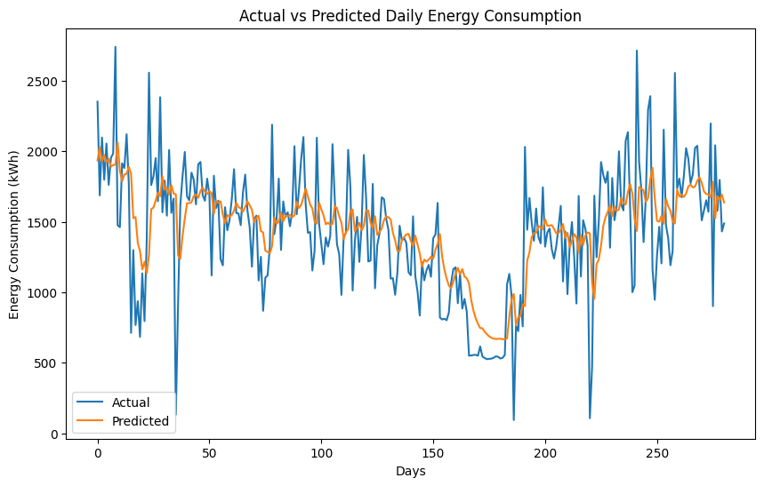

# Household Daily Power Consumption Forecasting

## Overview
This repository contains a project to predict household daily power consumption using historical data. The project utilizes an LSTM (Long Short-Term Memory) neural network model, a type of recurrent neural network (RNN), to analyze time-series data and forecast future energy consumption.

## Dataset
The dataset used in this project is `household_power_consumption.txt`, which records household energy consumption over four years. The file includes the following columns:

- **Date**: The date of the record.
- **Time**: The time of the record.
- **Global_active_power**: Total active power consumption (in kilowatts).
- **Global_reactive_power**: Total reactive power consumption (in kilowatts).
- **Voltage**: Average voltage (in volts).
- **Global_intensity**: Current intensity (in amperes).
- **Sub_metering_1**: Energy sub-metering No. 1 (in watt-hours).
- **Sub_metering_2**: Energy sub-metering No. 2 (in watt-hours).
- **Sub_metering_3**: Energy sub-metering No. 3 (in watt-hours).

## Features
1. Data preprocessing:
   - Parse dates and times.
   - Handle missing values.
   - Aggregate power consumption into daily totals.
2. Data normalization using Min-Max Scaling.
3. Sequence creation for time-series modeling.
4. LSTM model training and evaluation.
5. Metrics used for evaluation:
   - Mean Absolute Error (MAE).
   - Root Mean Squared Error (RMSE).
6. Visualization of actual vs predicted power consumption.

## Requirements

- Python 3.7+
- TensorFlow
- NumPy
- pandas
- scikit-learn
- matplotlib

Install the required packages using the following command:
```bash
pip install -r requirements.txt
```

## Usage

1. Clone the repository:
```bash
git clone https://github.com/maheshwaridevang/Household-Daily-Power-Consumption-Forecasting.git
cd Household-Daily-Power-Consumption-Forecasting
```

2. Place the `household_power_consumption.txt` file in the project directory.

3. Run the script to preprocess data, train the model, and visualize the predictions:
```bash
python predict_power_consumption.py
```

## Model
The LSTM model is designed to predict daily power consumption using the previous 30 days of data. The architecture consists of:
- An LSTM layer with 50 units and ReLU activation.
- A Dense layer to output a single value.

The model is trained for 20 epochs with a batch size of 16, using the Adam optimizer and Mean Squared Error (MSE) loss function.

## Results
The model's performance is evaluated using MAE and RMSE metrics. A plot is generated to compare actual vs predicted daily power consumption, providing insight into the model's accuracy.

## Project Structure
```
.
├── household_power_consumption.txt  # Dataset file (not included in the repo)
├── predict_power_consumption.py     # Main script for preprocessing, training, and visualization
├── README.md                        # Project documentation
├── requirements.txt                 # Dependencies for the project
```

## Example Visualization
The script generates a plot to compare the actual and predicted daily power consumption:



## Future Improvements
- Explore other architectures like GRU or Transformer for better performance.
- Implement hyperparameter tuning for optimal model performance.
- Extend the pipeline for real-time prediction.
- Incorporate additional features from the dataset to improve prediction accuracy.

## License
This project is licensed under the MIT License.

---

Feel free to contribute by submitting issues or pull requests!

